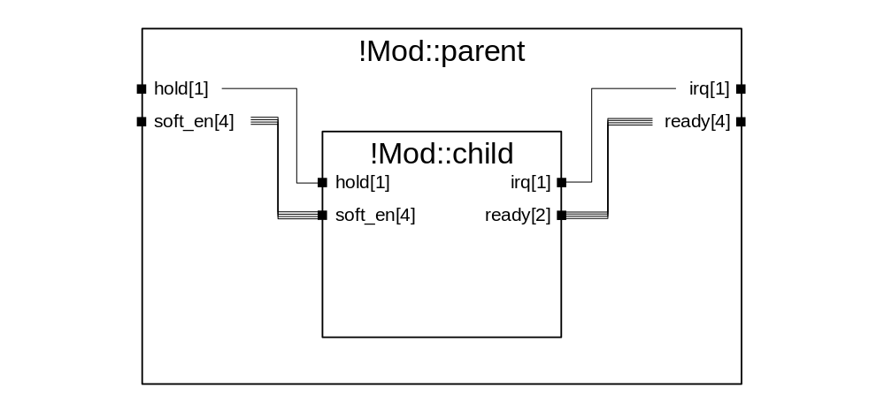
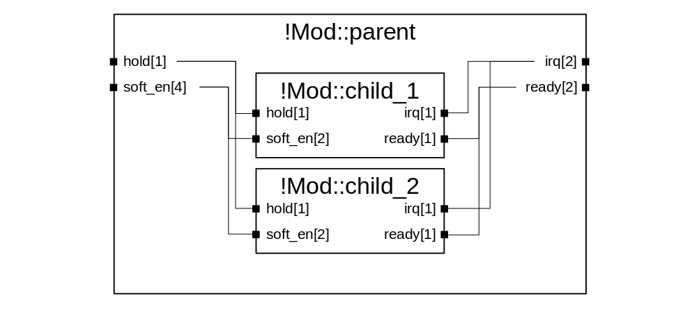

# Module Elaboration (!Mod)
Elaboration of `!Mod` tags occurs over a number of stages:

 1. The block is created as a DFBlock with its basic properties such as name, type, parent node, and description. Any options specified in the YAML description are attached as attributes, and the source file that contains the `!Mod` description is linked.
 2. The boundary IO described in the YAML are created and attached to the block as DFPorts. Again the name, attributes, type, description, and other parameters are filled in.
 3. If required, automatic clock and reset ports are created and attached to the block. This stage can be disabled by using the `NO_CLK_RST` or `NO_AUTO_CLK_RST` options in the `!Mod` description.
 4. The principal clock and reset signals are identified from the boundary IO, these will be distributed to any child modules with automatic clock and reset ports. Normally these will either be automatically created (as in step 3) or nominated by using the `AUTO_CLK` and `AUTO_RST` options. However, if a block generates a clock then the `clk_root` and `rst_root` parameters can select an output port from a child module as the principal clock signal.
 5. Child modules instantiated by the `!Mod` are expanded, these run a nested elaboration process (starting again from point 1). If the elaboration depth is restricted, then the nested elaborations will only populate the boundary IO and not the child modules.
 6. Explicit connections between ports or between a port and a constant (as defined in the `!Mod` under the `connections` parameter) are resolved. A number of different constructions are supported, these are shown in a later section. Any points that have an explicit connection are not considered in the implicit connection stage as either initiators or targets, even if they are underpopulated (this is to improve the predictability of the result).
 7. Clock and reset signals are automatically distributed to nominated principal signals on child modules. Unlike all other signals, if a principal clock or reset has explicit outbound connections from stage (4) the implicit connections are **still** elaborated.
 8. Implicit connections are elaborated - this is done in two passes. In the first pass connections are built using the 'strict' ruleset (both port name and type must match), in the second pass the 'name' rule is relaxed and only port type matching is required. In both passes only completely unconnected ports are considered - so if a port is partially populated in the first pass, it will be ignored in the second. A number of rules are used to build connections, these are covered in a later section.
 9. If a register definition is included into the file where the `!Mod` is declared then the register set will be expanded and attached onto the `DFBlock`. The register elaboration process is discussed [separately](./register.md).
 10. The elaborator runs a check for any unconnected ports and logs a warning for each. These warnings are collected in the report and can be exported to a HTML summary.
 11. The final stage is address map elaboration, which occurs if any `!Initiator` and `!Target` tags are listed within the `addressmap` section of the `!Mod` description. The elaboration process is discussed [separately](./addressmap.md).

## Explicit Connection Rules
Where an explicit connection is formed between two ports, there are a number of rules that can be invoked.

### One-to-One Explicit Connections

The most simple connection type has the same number of initiator ports as target ports and both end points carry the same number of signals. In this case the first signal within the initiator connects to the first signal in the target, and so on for as many signals are carried within the port (e.g. initiator[0]->target[0], initiator[1]->target[1], etc.). For example, in the above diagram `soft_en` on both `Mod::parent` (initiator) and `!Mod::child` (target) carry 4 signals. This would be described in the YAML syntax by:

```YAML
- !Mod
  name: parent
  ...
  connections:
  - !Connect
    points:
    - !Point [soft_en]
    - !Point [soft_en, child]
```

As a result, the following connections will be built:

```
!Mod::parent.soft_en[0] -> !Mod::child.soft_en[0]
!Mod::parent.soft_en[1] -> !Mod::child.soft_en[1]
!Mod::parent.soft_en[2] -> !Mod::child.soft_en[2]
!Mod::parent.soft_en[3] -> !Mod::child.soft_en[3]
```

In a slightly more complicated scenario, the number of initiator and target ports are the same but the number of signals carried within each end differs. In this case, fan-out connections are built for the number of signals that the target port carries while the initiator signal index wraps. For example if in the above diagram `ready` on `!Mod::child` (initiator) carries 2 signals, whereas the port on `!Mod::parent` (target) carries 4 signals. This would be described as:

```YAML
- !Mod
  name: parent
  ...
  connections:
  - !Connect
    points:
    - !Point [ready, child]
    - !Point [ready] # No module specified means port located on the parent
```

In this case the following connections will be built:

```
!Mod::child.ready[0] -> !Mod::parent.ready[0]
!Mod::child.ready[1] -> !Mod::parent.ready[1]
!Mod::child.ready[0] -> !Mod::parent.ready[2]
!Mod::child.ready[1] -> !Mod::parent.ready[3]
```

### One-to-Many Explicit Connections

A more complex connection scenario is where there is one parent port and multiple target ports, and so a fan-out is constructed. The connectivity depends on the number of signals carried within the parent port, and the total number of signals carried in all of the child ports.

In the diagram above, two different results of one-to-many connectivity are shown. The first case is a true fan-out, where one signal is connected to multiple target ports. In the diagram this is demonstrated where `hold` on `!Mod::parent` (initiator) is connected to `hold` on both `!Mod::child_1` and `!Mod::child_2` (targets). This would be described as:

```YAML
- !Mod
  name: parent
  ...
  connections:
  - !Connect
    points:
    - !Point [hold]          # Initiator
    - !Point [hold, child_1] # Target
    - !Point [hold, child_2] # Target
```

This results in the following connections:

```
!Mod::parent.hold[0] -> !Mod::child_1.hold[0]
!Mod::parent.hold[0] -> !Mod::child_2.hold[0]
```

The second case is formed of unique connections, where each signal within the target port is connected to a different signal on a different block. In the diagram this is demonstrated where `soft_en` on `!Mod::parent` (initiator) is connected to `soft_en` on both `!Mod::child_1` and `!Mod::child_2` (targets). This would be described as:

```YAML
- !Mod
  name: parent
  ...
  connections:
  - !Connect
    points:
    - !Point [soft_en]          # Initiator
    - !Point [soft_en, child_1] # Target
    - !Point [soft_en, child_2] # Target
```

This results in the following connections:

```
!Mod::parent.soft_en[0] -> !Mod::child_1.soft_en[0]
!Mod::parent.soft_en[1] -> !Mod::child_1.soft_en[1]
!Mod::parent.soft_en[2] -> !Mod::child_2.soft_en[0]
!Mod::parent.soft_en[3] -> !Mod::child_2.soft_en[1]
```

Note that as with one-to-one connections, initiator signal count will wrap if more connections are formed than are carried within the port. If the signal count of `soft_en` on `!Mod::parent` was reduced from 4 to 2, then the connectivity to `!Mod::child_1` and `!Mod::child_2` would become:

```
!Mod::parent.soft_en[0] -> !Mod::child_1.soft_en[0]
!Mod::parent.soft_en[0] -> !Mod::child_2.soft_en[0]
!Mod::parent.soft_en[1] -> !Mod::child_1.soft_en[1]
!Mod::parent.soft_en[1] -> !Mod::child_2.soft_en[1]
```

### Many-to-Many Explicit Connections
Currently this connectivity type is not supported. This means you cannot create connections where there are multiple initiator and multiple target ports, but the number of each is not equal.

### Tied to Constant Value
For input ports (or output ports on the parent block) with primitive types (e.g. `wire`) it is possible to tie the value to a constant in the YAML description. This could be used to tie off dangling input IO on a complex IP that is reused in multiple places for different purposes. In this case a connection is formed with the initiator as a constant and the target as the primitive port. This would be described in YAML as:

```YAML
- !Mod
  name: parent
  ...
  connections:
  - !Connect
    constants:
    - !Const [5]
    - !Point [my_value_to_tie_off, child]
```

## Clock and Reset Distribution Rules
Clock and reset signals are treated in a different fashion to other signal types. Firstly, to provide some context, BLADE has a concept of 'principal' ports, which are signals nominated either automatically by the tool or within the source YAML to have special significance. Examples of principal signals are the main clock and reset to a block, which may need to be distributed to child modules.

In the case where neither `NO_AUTO_CLK_RST` nor `NO_CLK_RST` are present within the `!Mod's` option list, clock and reset signals are created and injected during elaboration (see step 1 above of the `!Mod` elaboration process) and are nominated as the principal signals of the block.

Where either `NO_AUTO_CLK_RST` or `NO_CLK_RST` is specified, the designer can nominate a prinicipal port for clock or reset by using the `AUTO_CLK` and `AUTO_RST` options on the relevant `!HisRef`:

```YAML
- !Mod
  name   : my_mod
  options: [NO_AUTO_CLK_RST]
  ...
  ports  :
  - !HisRef [clk_s, clock, 'Main clock signal', 1, SLAVE, '', [AUTO_CLK]]
  - !HisRef [rst  , reset, 'Main reset signal', 1, SLAVE, '', [AUTO_RST]]
  - !HisRef [clk_2, clock, 'Secondary clock'  , 1, SLAVE, '', []        ]
  ...
```

There is also the option to use the output of a child block as the prinicipal clock or reset, this is useful for scenarios where a clock generator or gate is instantiated. In this case, the `clk_root` and `rst_root` attributes must be set on the parent `!Mod` - this is demonstrated in the following example:

```YAML
- !Mod
  name    : my_wrapper
  options : [NO_AUTO_CLK_RST]
  clk_root:
  - !Point [clk_out, clk_gen]
  rst_root:
  - !Point [rst_out, clk_gen]
  ports   :
  - !HisRef [clk, clock, 'Primary clock signal', 1, SLAVE, '', [AUTO_CLK]]
  - !HisRef [rst, reset, 'Primary reset signal', 1, SLAVE, '', [AUTO_RST]]
  ...
  modules :
  - !ModInst [clk_gen, clock_generator, 'Clock generator'   , 1]
  - !ModInst [reg_blk, registers      , 'Register interface', 1]
  ...
  connections:
  - !Connect
    points:
    - !Point [clk]
    - !Point [clk_in, clk_gen]
  - !Connect
    points:
    - !Point [rst]
    - !Point [rst_in, clk_gen]
  ...
```

Note that while the primary clock and reset signals are marked as `AUTO_CLK` and `AUTO_RST`, they are not routed to the child nodes. Instead the markers are used when `!Mod::my_wrapper` is instantiated in a parent block in order to route the clock and reset signals to the instance. Within `!Mod::my_wrapper` the automatic clock routing to child nodes such as `!Mod::reg_blk` will obey the points defined by `clk_root` and `rst_root`.

One other point of note is that unlike other signals, principal clock and reset signals can be both explicitly and automatically routed. Explicit routing occurs first (step 4 of module elaboration), then automatic clock/reset distribution runs (step 5). Principal signals will still be used as initiators even if they are already driving targets, however targets that are already driven will be ignored during the automatic routing phase even if they are under populated (i.e. port carries more than one signal and some signals within the port remain unconnected).

## Implicit Connection Rules
Implicit connectivity is a trickier problem to solve as the tool needs to make decisions on how the designer intended the design to be connected up. The tool needs to be able to make three different types of connections: parent-to-child, child-to-parent, and child-to-child. Correct connections are inferred from both the name and type of each endpoint. Two rules overarch implicit connectivity:

 1. Connections can only be formed between a compatible pair - for example an input port on the parent can be connected to an input port on a child or an output port on the parent, but it cannot be connected to any input port on the parent.
 2. Automatic connections will not be formed between outputs and inputs of the **same** block, if this is desired then an explicit connection must be declared.

Automatic routing occurs in two phases. In the first phase (strict) both the name and the signal type of the endpoints must be an exact match - for example a port of type `wire` on the parent `!Mod` called `enable` will only be connected to ports on child modules with the name `enable` of type `wire`. In the second phase (relaxed) only the signal type of the endpoints is considered when forming connections - for example a port of type `wire` on the parent `!Mod` called `disable` will be routed to any unpopulated ports on child modules of type `wire`. Note that both phases only examine ports that are completely unconnected, therefore any underpopulated ports left after phase 1 has completed will **not** be further connected in phase 2 - this is to reduce the risk of a misconnection being formed. Any ports that remain unconnected or underpopulated after both phases should be detected and warnings raised.

However, in a complex design it may be necessary for some signals to be tied off where an IP is reused in multiple different scenarios. As documented in a previous section, primitive input signals can be tied to a constant value using a `!Connect` tag with the initiator being a `!Const` tag. For more complex input ports, or where an output port should be left unconnected, the tool allows a list of `defaults` to be provided. This is demonstrated in the example below:

```YAML
- !Mod
  name    : my_block
  ...
  modules :
  - !ModInst [reg_blk, registers, 'Register interface', 1]
  ...
  defaults:
  - !Point [dma_ctrl, reg_blk]
  ...
```

In this case, all ports on the child `reg_block` will be connected following normal explicit and implicit elaboration rules - but the port `dma_ctrl` will be left unconnected, and the tool will not warn about it dangling, even if an identically named port with the same type exists on another child, or on the parent.

The same structures of fan-in and fan-out connectivity are supported as explicit connections. The connection builder works through the initiators for each case, and tries to identify as many targets as possible. The algorithm tracks the last connected signal index for each initiator, wrapping back to zero every time the signal count of the port is exhausted.

## API
```eval_rst
.. automodule:: blade.elaborate.module
    :members:
    :undoc-members:
```
